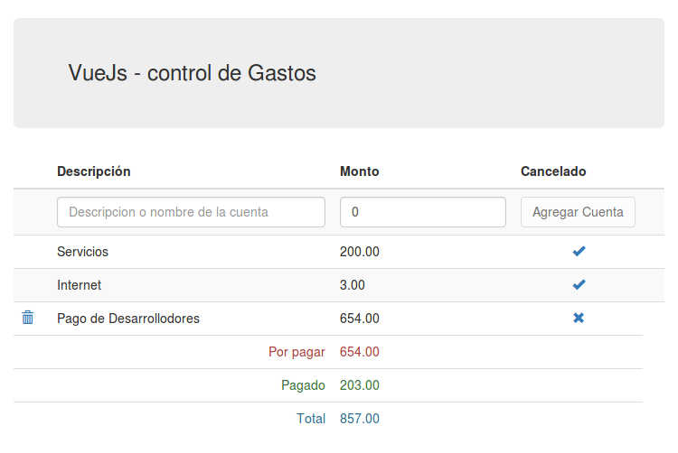

# Vuejs Grid


<h1 align="center">Llenado de una tabla automatico</h1>


Sencillo ejemplo con VueJs, en le cual se llevan las cuentas pagadas, se realiza sumas automaticas.


``` bash
  index.html
```
<p align="center">
    
</p>
Cuentas de gastos, se puede agregar, borrar y pagar.

## Que hace
Es algo muy simple, en un archivo html se llena dinamicante una tabla (bootstrap) con los datos que se ingresan por teclado, mostrando los totales pagados y pendientes por pagar.

La verdad, nada del otro mundo, todo se hace con vueJs, no posee conexion a base de datos.